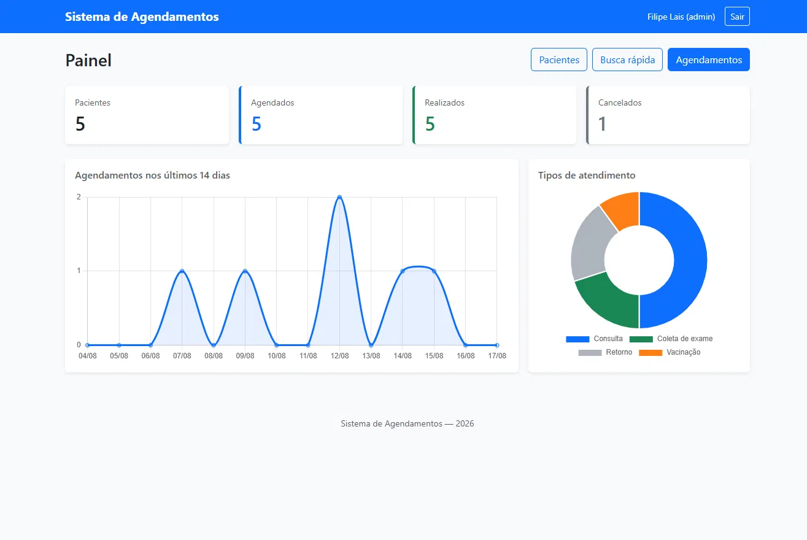
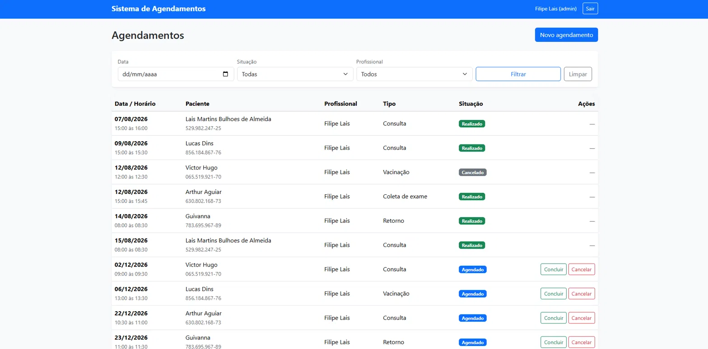
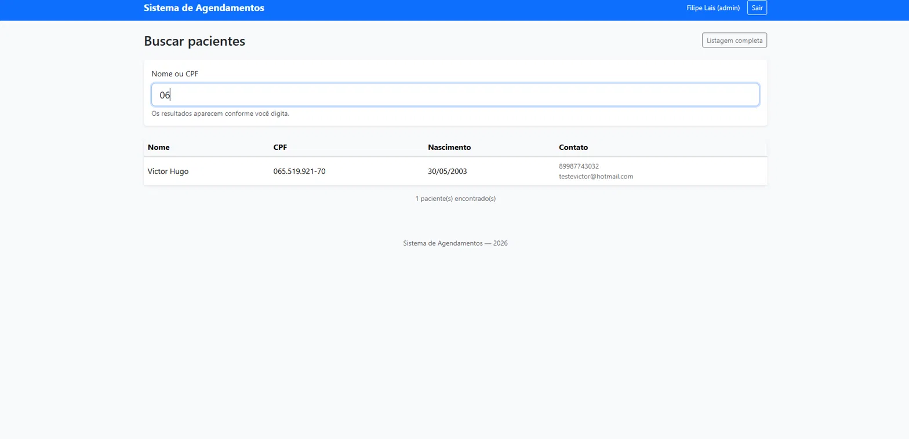
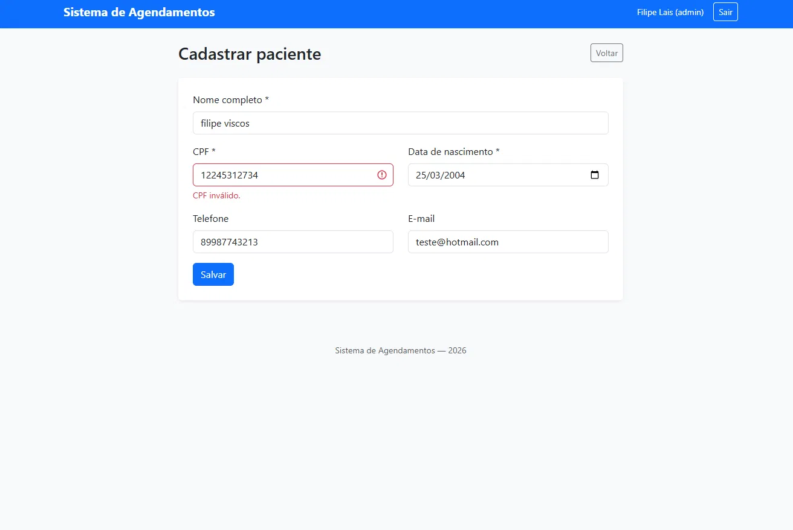

# 🏥 Sistema de Agendamento de Atendimentos

Sistema web para gestão de pacientes e agendamento de atendimentos, desenvolvido em PHP com foco em segurança, integridade de dados e regras de negócio reais.

---

## 📋 Sobre o projeto

O sistema permite que uma unidade de atendimento controle seu cadastro de pacientes e a agenda dos profissionais, com verificação automática de conflito de horários e acompanhamento da situação de cada atendimento.

Foi construído sem frameworks, em PHP puro, com o objetivo de demonstrar domínio dos fundamentos da linguagem, do banco de dados relacional e das práticas de segurança aplicadas a sistemas que lidam com dados sensíveis.

---

## 📸 Telas

### Painel de indicadores


### Agendamentos


### Busca em tempo real


### Validação de dados


## ⚙️ Funcionalidades

### Autenticação e controle de acesso
- Login com senha criptografada
- Dois perfis de acesso: administrador e atendente
- Proteção de rotas por sessão
- Regeneração de ID de sessão após autenticação

### Gestão de pacientes
- Cadastro com validação de CPF (dígitos verificadores)
- Listagem com busca por nome ou CPF e paginação
- Edição e exclusão com verificação de vínculos
- Busca dinâmica em tempo real, sem recarregar a página

### Agendamentos
- Registro de atendimentos vinculando paciente e profissional
- **Verificação automática de conflito de horário** por sobreposição de intervalos
- Duração configurável por atendimento
- Controle de situação: agendado, realizado ou cancelado
- Filtros por data, situação e profissional

### Painel de indicadores
- Totais consolidados de pacientes e atendimentos
- Gráfico de agendamentos dos últimos 14 dias
- Distribuição por tipo de atendimento

---

## 🔒 Segurança implementada

| Vulnerabilidade | Proteção aplicada |
|---|---|
| SQL Injection | Prepared statements em todas as consultas, com `PDO::ATTR_EMULATE_PREPARES = false` para uso de prepared statements nativos |
| XSS (Cross-Site Scripting) | Escape de toda saída com `htmlspecialchars()` e `ENT_QUOTES`, incluindo escape no lado do cliente ao renderizar dados da API |
| CSRF | Token por sessão gerado com `random_bytes()` e comparado com `hash_equals()` (comparação em tempo constante) |
| Session fixation | `session_regenerate_id(true)` após autenticação bem-sucedida |
| Vazamento de senhas | Hash com `password_hash()` / `password_verify()` |
| User enumeration | Mensagem de erro genérica no login |
| Exposição de dados internos | Mensagens de erro genéricas ao usuário; detalhes técnicos não são exibidos |
| Acesso não autorizado | Verificação de sessão centralizada, aplicada também aos endpoints da API |
| Exposição de credenciais | Arquivo de conexão fora do controle de versão |

---

## 🛠️ Tecnologias utilizadas

**Back-end**
- PHP 8.2
- PDO para acesso ao banco
- MariaDB / MySQL

**Front-end**
- Bootstrap 5.3
- JavaScript (ES6+) com Fetch API
- Chart.js para visualização de dados

**Ferramentas**
- Git e GitHub
- XAMPP (Apache + MariaDB)

---

## 🗄️ Modelagem do banco de dados

```
usuarios                pacientes               agendamentos
--------                ---------               ------------
id (PK)                 id (PK)                 id (PK)
nome                    nome                    paciente_id (FK) --> pacientes.id
email (UNIQUE)          cpf (UNIQUE)            usuario_id  (FK) --> usuarios.id
senha                   data_nascimento         data_hora
perfil (ENUM)           telefone                duracao_minutos
ativo                   email                   tipo_atendimento
criado_em               criado_em               status (ENUM)
                                                observacoes
                                                criado_em
```

### Script de criação

```sql
CREATE TABLE usuarios (
    id INT AUTO_INCREMENT PRIMARY KEY,
    nome VARCHAR(100) NOT NULL,
    email VARCHAR(150) NOT NULL UNIQUE,
    senha VARCHAR(255) NOT NULL,
    perfil ENUM('admin', 'atendente') NOT NULL DEFAULT 'atendente',
    ativo BOOLEAN NOT NULL DEFAULT TRUE,
    criado_em TIMESTAMP DEFAULT CURRENT_TIMESTAMP
);

CREATE TABLE pacientes (
    id INT AUTO_INCREMENT PRIMARY KEY,
    nome VARCHAR(150) NOT NULL,
    cpf VARCHAR(11) NOT NULL UNIQUE,
    data_nascimento DATE NOT NULL,
    telefone VARCHAR(20),
    email VARCHAR(150),
    criado_em TIMESTAMP DEFAULT CURRENT_TIMESTAMP
);

CREATE TABLE agendamentos (
    id INT AUTO_INCREMENT PRIMARY KEY,
    paciente_id INT NOT NULL,
    usuario_id INT NOT NULL,
    data_hora DATETIME NOT NULL,
    duracao_minutos INT NOT NULL DEFAULT 30,
    tipo_atendimento VARCHAR(100) NOT NULL,
    status ENUM('agendado', 'realizado', 'cancelado') NOT NULL DEFAULT 'agendado',
    observacoes TEXT,
    criado_em TIMESTAMP DEFAULT CURRENT_TIMESTAMP,

    FOREIGN KEY (paciente_id) REFERENCES pacientes(id),
    FOREIGN KEY (usuario_id) REFERENCES usuarios(id)
);
```

---

## 🔌 API REST

O sistema expõe endpoints que retornam JSON, consumidos pelo próprio front-end e disponíveis para integração com outras aplicações.

### `GET /api/pacientes.php`

Lista pacientes, com filtro opcional.

**Parâmetros**

| Nome | Tipo | Descrição |
|---|---|---|
| `busca` | string | Filtra por nome ou CPF (opcional) |
| `limite` | int | Quantidade máxima de registros (1 a 50, padrão 20) |

**Resposta — 200 OK**
```json
{
  "total": 2,
  "dados": [
    {
      "id": 1,
      "nome": "Maria Silva",
      "cpf": "52998224725",
      "cpf_formatado": "529.982.247-25",
      "data_nascimento": "1990-05-12",
      "telefone": "81999998888",
      "email": "maria@exemplo.com"
    }
  ]
}
```

### `GET /api/pacientes.php?id={id}`

Retorna um paciente específico.

**Respostas**
- `200` — paciente encontrado
- `404` — paciente não encontrado

### `POST /api/pacientes.php`

Cadastra um novo paciente. Corpo em JSON.

**Requisição**
```json
{
  "nome": "João Souza",
  "cpf": "529.982.247-25",
  "data_nascimento": "1985-03-20",
  "telefone": "81988887777",
  "email": "joao@exemplo.com"
}
```

**Respostas**
- `201` — cadastrado com sucesso
- `422` — dados inválidos (retorna os erros por campo)
- `409` — CPF já cadastrado

**Exemplo de erro — 422**
```json
{
  "erro": "Dados inválidos.",
  "detalhes": {
    "cpf": "CPF inválido.",
    "data_nascimento": "A data de nascimento não pode ser futura."
  }
}
```

### `GET /api/estatisticas.php`

Retorna os indicadores consolidados do painel: totais gerais, agendamentos por dia dos últimos 14 dias e distribuição por tipo de atendimento.

### Autenticação

Todos os endpoints exigem sessão ativa. Requisições não autenticadas recebem `401 Unauthorized`.

---

## 🧠 Decisões técnicas

Esta seção registra o raciocínio por trás das principais escolhas do projeto.

### Verificação de conflito por sobreposição de intervalos

O sistema não trabalha com horários fixos: cada atendimento tem início e duração próprios. Dois atendimentos conflitam quando seus intervalos se sobrepõem, o que é verificado pela condição:

```
inicioNovo < fimExistente  AND  fimNovo > inicioExistente
```

O uso de comparação estrita (`<` e `>`, não `<=` e `>=`) é intencional: um atendimento das 10:00 às 10:30 não impede outro começando exatamente às 10:30.

O cálculo é feito no banco com `DATE_ADD`, evitando trazer todos os registros para a aplicação e comparar em PHP.

Agendamentos cancelados são desconsiderados — cancelar libera o horário. Na edição, o próprio registro é excluído da verificação, para que salvar sem alterar o horário não gere falso conflito.

### Validação real de CPF

A validação confere os dígitos verificadores matematicamente, além de rejeitar sequências repetidas. Validar apenas o comprimento aceitaria `12345678901` como válido — inaceitável em um sistema que identifica pacientes pelo documento.

### CPF armazenado sem formatação

O banco guarda apenas os 11 dígitos; a formatação é aplicada na exibição. Isso mantém a consistência (um mesmo CPF não pode ser gravado de duas formas diferentes) e permite que a busca funcione independentemente de como o usuário digitar.

O campo é `VARCHAR`, não `INT`: CPFs podem começar com zero, e não há operação aritmética sobre eles.

### Integridade referencial no banco

As chaves estrangeiras garantem que não exista agendamento apontando para paciente inexistente. A aplicação também verifica vínculos antes de excluir um paciente — não por redundância inútil, mas por camadas distintas: o banco garante a consistência dos dados, a aplicação garante uma mensagem compreensível ao usuário.

### Exclusão lógica de usuários

Usuários do sistema possuem o campo `ativo` em vez de serem removidos. Apagar um usuário eliminaria o vínculo com os agendamentos que ele registrou, comprometendo a rastreabilidade — requisito básico em ambiente de saúde.

Pela mesma razão, agendamentos cancelados mantêm o registro com status alterado, em vez de serem excluídos.

### Validação em camadas

Os atributos `required` e `min` nos formulários orientam o usuário, mas toda regra é reavaliada no servidor. Validação no navegador é experiência de uso; validação no servidor é segurança. Uma requisição pode ser enviada sem passar pelo formulário.

### Separação entre API e apresentação

As páginas do painel não executam consultas: solicitam os dados à API e cuidam apenas da renderização. A mesma API poderia atender um aplicativo móvel ou outro sistema sem qualquer alteração.

### Debounce na busca dinâmica

A busca aguarda 400 ms de inatividade antes de consultar a API. Sem isso, digitar um nome de cinco letras dispararia cinco requisições — carga desnecessária no servidor e resultados chegando fora de ordem.

### Escape de saída em ambas as camadas

O PHP escapa a saída no HTML renderizado no servidor. O JavaScript escapa novamente ao inserir dados vindos da API no DOM. São contextos distintos de renderização, e cada um exige seu próprio tratamento.

### Preenchimento de lacunas no gráfico

A consulta agrupada por dia retorna apenas as datas com registros. Dias sem agendamento simplesmente não apareceriam, distorcendo a linha do tempo. Por isso o resultado é reindexado e os 14 dias são montados na aplicação, preenchendo zeros onde não há dados.

---

## 📁 Estrutura do projeto

```
sistema-agendamentos/
├── api/
│   ├── bootstrap.php          # Base da API: resposta JSON, autenticação, helpers
│   ├── pacientes.php          # Endpoint de pacientes
│   └── estatisticas.php       # Endpoint de indicadores
├── agendamentos/
│   ├── cadastrar.php          # Registro com verificação de conflito
│   ├── listar.php             # Listagem com filtros e JOINs
│   └── status.php             # Alteração de situação
├── assets/
│   ├── css/
│   └── js/
│       ├── busca-pacientes.js # Busca dinâmica via Fetch API
│       └── dashboard.js       # Gráficos com Chart.js
├── auth/
│   ├── login.php
│   └── logout.php
├── config/
│   └── conexao.example.php    # Modelo de configuração
├── includes/
│   ├── auth_check.php         # Proteção de rotas e verificação de perfil
│   ├── funcoes.php            # Validações, CSRF, formatação
│   ├── header.php
│   └── footer.php
├── pacientes/
│   ├── cadastrar.php
│   ├── listar.php             # Listagem com busca e paginação
│   ├── editar.php
│   ├── excluir.php
│   └── buscar.php             # Busca em tempo real
├── .gitignore
└── index.php                  # Painel de indicadores
```

---

## ▶️ Como executar

### Requisitos
- PHP 8.1 ou superior
- MariaDB ou MySQL
- Servidor Apache (ou o servidor embutido do PHP)

### Passos

1. Clone o repositório na pasta do servidor web:
   ```bash
   git clone https://github.com/filipelais/sistema-agendamentos.git
   ```

2. Crie o banco de dados:
   ```sql
   CREATE DATABASE sistema_agendamentos CHARACTER SET utf8mb4;
   ```

3. Execute o script de criação das tabelas (seção *Modelagem do banco de dados*).

4. Configure a conexão:
   ```bash
   cp config/conexao.example.php config/conexao.php
   ```
   Edite `config/conexao.php` com as credenciais do seu ambiente.

5. Crie o primeiro usuário administrador. Como a senha precisa ser armazenada com hash, gere-a pelo PHP:
   ```bash
   php -r "echo password_hash('suaSenha', PASSWORD_DEFAULT);"
   ```
   E insira o registro:
   ```sql
   INSERT INTO usuarios (nome, email, senha, perfil)
   VALUES ('Administrador', 'admin@exemplo.com', 'HASH_GERADO_ACIMA', 'admin');
   ```

6. Inicie o Apache e o MariaDB e acesse:
   ```
   http://localhost/sistema-agendamentos/
   ```

---

## 🚧 Melhorias previstas

- Extrair as regras de validação para classes reutilizáveis, eliminando a duplicação entre formulários web e endpoints da API
- Substituir as ações de exclusão e alteração de status por requisições POST, seguindo a semântica correta dos verbos HTTP
- Implementar registro de auditoria das operações
- Containerizar o ambiente com Docker e Docker Compose
- Adicionar testes automatizados para as regras de negócio

---

## 👤 Autor

Desenvolvido por **Filipe Lais**
[github.com/filipelais](https://github.com/filipelais)
